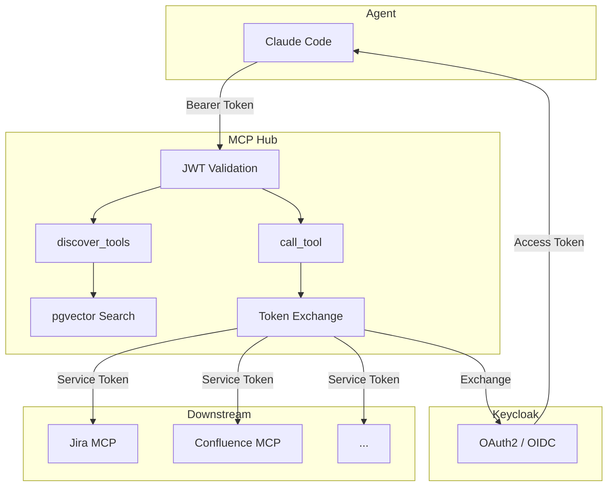

# MCP Registry

Centralized hub for discovering and proxying MCP tool calls across enterprise services. Solves the N*M agent-to-service auth problem by acting as a single trust boundary.

## Architecture



## Quick Start

```bash
docker compose up -d          # postgres + keycloak
sleep 30                      # wait for keycloak

cd backend && go build -o ../bin/server ./cmd/server && go build -o ../bin/hub ./cmd/hub
AUTH_ENABLED=false ../bin/server &
AUTH_ENABLED=false ../bin/hub &
```

## E2E Test

```bash
./e2e_test.sh    # auth → register → sync → discover → call
```

## Key Features

- **MCP Hub Gateway** — Streamable HTTP, JSON-RPC 2.0, exposes `discover_tools` + `call_tool`
- **Semantic Search** — pgvector cosine similarity with Ollama/OpenAI embeddings, ILIKE fallback
- **Auth** — Keycloak JWT validation + OAuth2 Token Exchange (RFC 8693)
- **N+M instead of N*M** — agents auth to Hub, Hub exchanges tokens to downstream services

## OWASP NHI Top 10

See [ROADMAP.md](ROADMAP.md) for full coverage plan.

| Risk | Status |
|------|--------|
| NHI3 — Vulnerable Third-Party NHI | Covered |
| NHI4 — Insecure Authentication | Covered |
| NHI9 — NHI Reuse | Covered |
| NHI1, 2, 5–8, 10 | Planned |
