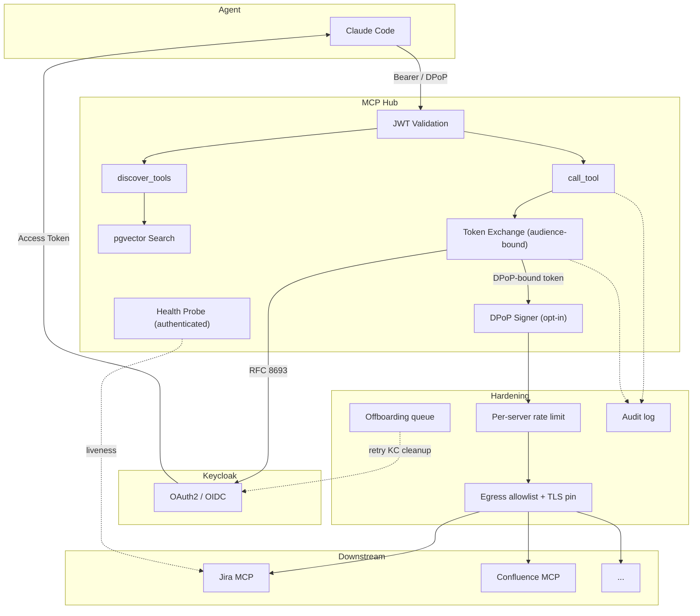

# MCP Registry

Centralized hub for discovering and proxying MCP tool calls across enterprise services.
Solves the N×M agent-to-service auth problem by acting as a single trust boundary —
agents authenticate once to the hub, the hub mints scoped, audience-bound tokens for
each downstream MCP server.

Built around the [OWASP Non-Human Identities Top 10 (2025)](https://owasp.org/www-project-non-human-identities-top-10/);
all ten categories have at-rest implementations — see the [coverage matrix](#owasp-nhi-top-10-coverage)
below.

## Architecture



## Quick start

```bash
cp .env.example .env                  # then edit secrets — DB_PASSWORD, MCP_HUB_CLIENT_SECRET, etc.
docker compose up -d                  # postgres + keycloak
sleep 30                              # wait for keycloak realm import

cd backend
go build -o ../bin/server ./cmd/server
go build -o ../bin/hub    ./cmd/hub
../bin/server &                       # REST API on :8080
../bin/hub &                          # MCP hub on :8081
```

For local development without Keycloak, set `AUTH_ENABLED=false` in `.env`. Auth is on
by default, and several other flags ship secure-by-default; see [Configuration](#configuration).

End-to-end test (auth → register → sync → discover → call):

```bash
set -a; source .env; set +a
./e2e_test.sh
```

## Configuration

All configuration is environment-based. `.env.example` is the source of truth — copy it
to `.env` and edit. Highlights:

| Variable | Default | Purpose |
| --- | --- | --- |
| `AUTH_ENABLED` | `true` | Set `false` only for local dev |
| `OIDC_CLIENT_SECRET` | *(required)* | Hub's KC client secret. Server refuses to start with the documented placeholder |
| `MCP_HUB_CLIENT_SECRET` | *(required)* | Substituted into the realm import at `docker compose up` time |
| `COOKIE_SECURE` | `true` | Refresh-token cookie attributes |
| `MCP_REQUIRE_HTTPS` | `true` | Reject `http://` registrations |
| `MCP_BLOCK_PRIVATE_IPS` | `true` | SSRF guard — block RFC1918/loopback/CGNAT |
| `MCP_TLS_PIN` | `true` | Capture leaf-cert SHA-256 on register; verify on every call |
| `MCP_EGRESS_ALLOWLIST` | *(empty)* | CSV of hosts/IPs/CIDRs the hub may dial |
| `MCP_PER_SERVER_RPS` / `_BURST` | `20` / `40` | Token-bucket rate limit per `server_id` |
| `DPOP_ENABLED` | `false` | Bind exchanged tokens to a P-256 keypair (RFC 9449) |
| `DPOP_KEY_PATH` | *(empty)* | PEM file for the DPoP key. Empty = ephemeral (regenerated each restart) |
| `MCP_BROWSER_FLOW` | `browser` | Set to `mcp-admin-browser` to require TOTP for any user with `mcp-admin` |
| `METRICS_ENABLED` / `METRICS_TOKEN` | `true` / *(empty)* | `GET /internal/metrics`. Set a token in production |
| `METRICS_STALE_PIN_DAYS` | `90` | Pin age that triggers `stale_warning` in the metrics payload |
| `HEALTH_CHECK_INTERVAL` / `HEALTH_FAILURE_THRESHOLD` | `30s` / `3` | Background probing |

The server logs a `WARNING: insecure overrides active (...)` line at boot listing every
secure default that was disabled. The line is silent when the configuration is fully
hardened.

## API surface

REST API (`:8080`):

| Method | Path | Role | Notes |
| --- | --- | --- | --- |
| GET | `/api/servers` | `mcp-user` | List registered servers |
| POST | `/api/servers` | `mcp-admin` | Register; auto-provisions a Keycloak client |
| DELETE | `/api/servers/{id}` | `mcp-admin` | Cascade offboarding (see below) |
| POST | `/api/servers/{id}/sync` | `mcp-admin` | Pull tools from the remote server |
| PUT | `/api/servers/{id}/tools/{name}/roles` | `mcp-admin` | Set per-tool RBAC |
| GET | `/api/servers/{id}/health` | `mcp-user` | Last probe result |
| POST | `/api/servers/{id}/health` | `mcp-admin` | Trigger probe now |
| POST | `/api/servers/{id}/repin` | `mcp-admin` | Re-capture TLS pin; audit logs old/new |
| GET | `/internal/metrics` | token | Admin-secret age, refresh count, pin ages |
| GET | `/auth/{login,callback,logout,refresh,me}` | — / cookie | OIDC SPA flow |

MCP hub (`:8081`): single `POST /mcp` endpoint exposing two tools — `discover_tools`
and `call_tool` — over Streamable HTTP / JSON-RPC 2.0.

## Operations

**Offboarding.** Deleting a server marks it inactive immediately, then synchronously
attempts to revoke and delete the Keycloak client. Failures enqueue a job in
`offboarding_queue`; a background worker retries with exponential backoff (30s → 1h, 12
attempts). Each attempt — sync or worker — emits an audit event with
`metadata.keycloak_client_id` so SIEM can prove cleanup completed.

**TLS pin lifecycle.** Pins are captured on register and timestamped. Operators can
re-pin via `POST /api/servers/{id}/repin`; the audit event records old + new
fingerprints. `/internal/metrics` flags pins older than `METRICS_STALE_PIN_DAYS`.

**Health gate + rate limit.** When a server's `consecutive_failures` is at or above
the failure threshold, the hub rejects calls with `denial_reason=downstream_unhealthy`.
Per-server token-bucket additionally caps RPS; over-budget calls are rejected with
`denial_reason=rate_limited`.

**Audit stream.** JSON-line events to stdout (for SIEM) and rows in `audit_log`. See
[`docs/security-monitoring.md`](docs/security-monitoring.md) for the full event
schema and a starter rule set (bulk-delete bursts, off-hours admin writes,
unexpected-audience exchanges, unhealthy-cadence admin token refresh, etc.).

## OWASP NHI Top 10 coverage

| # | Category | Coverage summary |
| --- | --- | --- |
| **NHI1** | Improper Offboarding | `DELETE /api/servers/{id}` cascades: deactivate row → revoke tokens → delete Keycloak client → drop server row (FK-cascades `tools`, `tool_required_roles`, `server_health`). Keycloak failures enqueue retry jobs in `offboarding_queue` ([backend/internal/offboarding/](backend/internal/offboarding/)) with exponential backoff up to 12 attempts; a background worker drains the queue and emits an audit event with `keycloak_client_id` on each outcome. |
| **NHI2** | Secret Leakage | No plaintext secrets in the repo — `keycloak/realm-export.template.json` uses `${env.X}` substitution at import time; secrets come from `.env` (gitignored) with `.env.example` as the public template. CI runs gitleaks on every push ([.github/workflows/gitleaks.yml](.github/workflows/gitleaks.yml), [.gitleaks.toml](.gitleaks.toml)). The hub refuses to start with the documented placeholder secret. Cookies are HttpOnly + Secure by default. |
| **NHI3** | Vulnerable Third-Party NHI | Outbound HTTP client enforces TLS 1.2+, leaf-cert SHA-256 pinning ([backend/internal/security/client.go](backend/internal/security/client.go)), and a per-server token-bucket rate limit ([backend/internal/ratelimit/](backend/internal/ratelimit/)). The hub is the single trust boundary — agents never get downstream credentials directly. Health probes share the same TLS pin and SSRF guard. Stale pins surface in `/internal/metrics`; operators re-pin via `POST /api/servers/{id}/repin`. |
| **NHI4** | Insecure Authentication | Keycloak OIDC with PKCE/S256 on the SPA, RS256 + JWKS validation on every request, and OAuth2 Token Exchange (RFC 8693) on the hub→server hop. The exchanger validates audience format (`mcp-server-*`), re-checks role overlap as defence-in-depth, and audits every exchange ([backend/internal/auth/exchange.go](backend/internal/auth/exchange.go)). DPoP (RFC 9449) is available for token-binding outbound calls; opt-in via `DPOP_ENABLED=true` ([backend/internal/dpop/](backend/internal/dpop/)). Health probes use the hub's service-account token instead of running anonymously ([backend/internal/hub/probe.go](backend/internal/hub/probe.go)). |
| **NHI5** | Overprivileged NHI | Two-tier RBAC (`mcp-user`, `mcp-admin`) enforced by `RequireRole` middleware. Tool-level RBAC via `tools.required_roles`, with set/get admin endpoints. Audience-bound exchange refuses tokens for servers the caller has no role overlap with. The Keycloak admin client refuses to operate on any client whose `clientId` is outside the `mcp-server-` prefix — defence-in-depth even if the service account's KC role is over-broad ([backend/internal/keycloak/admin.go](backend/internal/keycloak/admin.go)). FGAP migration path is documented in [keycloak/README.md](keycloak/README.md). |
| **NHI6** | Insecure Cloud Config | Secure-by-default — `COOKIE_SECURE`, `MCP_REQUIRE_HTTPS`, `MCP_BLOCK_PRIVATE_IPS`, `MCP_TLS_PIN` all default to `true`; the server warns loudly when an operator opts out. CORS is pinned to `FRONTEND_URL`. Realm `redirectUris` and `webOrigins` are env-driven (no `["*"]`). Per-server rate limit + health gate prevent the hub from amplifying traffic to a flapping or hostile downstream. |
| **NHI7** | Long-Lived Secrets | Keycloak admin token is refreshed in the background at 80% TTL so callers never block on KC, and each refresh emits an audit event for cadence anomaly detection ([backend/internal/keycloak/admin.go](backend/internal/keycloak/admin.go)). `/internal/metrics` exposes `admin_secret_age_days`, `admin_token_refreshes`, and per-server `tls_cert_captured_at` so the security team can spot rotation gaps. TLS pins are stamped with `tls_cert_captured_at` (migration 010) and surfaced in the metrics payload with a configurable stale-warning threshold. |
| **NHI8** | Environment Isolation | Endpoint admission goes through a URLValidator (scheme, host allowlist, private-IP block) before any DNS happens. The HTTP client's dial path enforces a configurable egress allowlist (`MCP_EGRESS_ALLOWLIST`, supports hosts / IPs / CIDR) and the SSRF guard at the same layer ([backend/internal/security/client.go](backend/internal/security/client.go)). Per-realm config (`KEYCLOAK_REALM`) supports separate Keycloak realms per environment; tokens whose `iss` doesn't match are rejected by JWKS validation. |
| **NHI9** | NHI Reuse | One Keycloak client per registered MCP server (`mcp-server-<name>`), provisioned at registration time and torn down (with retries) on delete. Token Exchange issues a separate audience-scoped token per downstream call — agents never reuse a token across services. The hub itself uses a dedicated service account with the prefix-restricted admin client. |
| **NHI10** | Human Use of NHI | Every state-changing request is audited with actor (`sub`, `preferred_username`, `realm_roles`), `request_id`, `ip`, `user_agent`, `latency_ms`, and resource identifiers (`server_id`, `tool_name`). Denials carry `required_roles`, `caller_roles`, and `denial_reason` so SIEM can distinguish RBAC gaps from rate-limit / health-gate rejections. Admin MFA is available via the conditional-OTP browser flow `mcp-admin-browser` (set `MCP_BROWSER_FLOW=mcp-admin-browser`); see [keycloak/README.md](keycloak/README.md). [docs/security-monitoring.md](docs/security-monitoring.md) ships a starter rule set (A1–A9) covering bulk deletes, off-hours admin writes, repeated denials, and unusual exchange audiences. |

## Development

```bash
# Backend
cd backend
go build ./...
go vet ./...
go test ./...

# Frontend (Vite + React)
npm install
npm run dev                # http://localhost:5173

# Migrations are auto-applied by the postgres container at first boot
# (mounted into /docker-entrypoint-initdb.d). To reset:
docker compose down -v && docker compose up -d
```

The `e2e_test.sh` script builds the binaries, brings up the containers if they aren't
running, runs the full happy-path flow, and cleans up.

## Repository layout

```
backend/
  cmd/server/         REST API + offboarding worker + metrics endpoint
  cmd/hub/            MCP hub (JSON-RPC over Streamable HTTP)
  internal/
    audit/            Logger + Postgres sink + event schema
    auth/             JWT validation, OIDC SPA flow, RBAC, audience-bound exchange
    config/           Env-based config (single source of truth)
    dpop/             RFC 9449 signer (P-256 / ES256)
    embedding/        Ollama / OpenAI embedders
    entity/           Domain types
    health/           Background probe loop + health gate for the hub
    hub/              MCP proxy, tool discovery, RBAC enforcement, rate limit
    keycloak/         Admin client (token cache, prefix guard, secret age)
    metrics/          /internal/metrics implementation
    offboarding/      Retry queue + worker
    ratelimit/        Per-key token bucket (golang.org/x/time/rate)
    repository/       Postgres repos
    security/         URL validator + safe HTTP client (TLS pin, SSRF, egress)
    transport/http/   REST handlers
    usecase/          Server lifecycle business logic
  migrations/         SQL migrations (auto-applied)
keycloak/
  realm-export.template.json   Imported with ${env.X} substitution
  README.md                    Service-account / FGAP / MFA notes
docs/
  security-monitoring.md       SIEM contract + anomaly rule set
src/                           React + Vite frontend
```

## Roadmap

The original phased plan in [ROADMAP.md](ROADMAP.md) has been delivered — every NHI
category now has at-rest coverage. Future work tracks operational hardening: FGAP for
the Keycloak admin scope, anomaly-rule tuning per deployment, and integration tests
that exercise the offboarding-retry queue under simulated KC outages.
